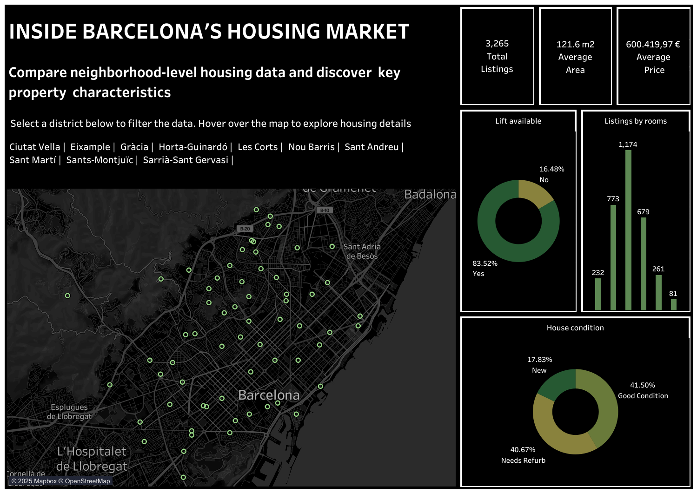

# 🏡 Barcelona Housing Analysis

This project explores housing listings across the city of **Barcelona**, using a dataset from Idealista scraped in 2020. The goal is to clean, analyze, and visualize property data to uncover insights about **prices, property characteristics, and geographic distribution**.

- 📍 **Objective**: To analyze housing trends by neighborhood and district, and present an interactive dashboard to explore market characteristics.

## 🛠 Tools & Technologies

| Tool             | Purpose                                      |
|------------------|----------------------------------------------|
| **Google Sheets** | Data cleaning, transformation & validation  |
| **MySQL**         | Structured analysis and aggregations         |
| **Tableau Public** | Interactive data visualization              |
| **Kaggle**        | Data source (Barcelona Idealista Listings)   |

## 🗂️ Project Structure

| Folder / File              | Description                                      |
|---------------------------|--------------------------------------------------|
| `Data/`                   | Contains the cleaned dataset in `.csv` format   |
| `Analysis/`               | SQL script with all queries used for analysis   |
| `Images/`                 | Visual assets, including the dashboard preview  |
| `README.md`               | Full project documentation (this file)          |

## 🧼 Data Cleaning Summary

The dataset was imported and cleaned in **Google Sheets**, using a structured approach with three dedicated tabs:

### 📄 Tabs Used:
- **Raw_data**: Original dataset as downloaded
- **Data_cleaning**: Summary table to track cleaning metrics
- **Cleaned_Data**: Final cleaned dataset, ready for SQL/Tableau analysis

### 🔍 Cleaning Steps Performed:
- ✅ Removed 2 empty rows from the bottom of the dataset
- ✅ Created a cleaning summary including:
  - Null values per column
  - Count of unique values
  - Sample of unique values (Top 10)
  - Duplicate detection (especially in `ID`)
- ✅ Applied `TRIM()` and `PROPER()` to standardize capitalization and remove extra spaces from text columns:
  - `Condition`, `Type`, `District`, `Neighborhood`, `Views`, `Lift`
- ✅ Verified numeric columns (`Price`, `Area_m2`, `Rooms`, `Floor_number`) contain only valid values
- ✅ Created new tab `Cleaned_Data` with all transformations applied using `ARRAYFORMULA`

The cleaned dataset was then exported as `.csv` and is ready for SQL import and further visualization in Tableau.

## 🧠 SQL-Based Data Analysis

After cleaning the dataset in Google Sheets, the final `.csv` file (`Barcelona_Housing_Prices_2020`) was exported and imported into **MySQL** to perform structured SQL analysis.

This allowed us to:
- Aggregate housing data by neighborhood, district, and property characteristics
- Calculate price-related metrics (e.g., average price, price per m²)
- Derive insights used directly in the Tableau visualizations

The full set of queries used is available in [`Analysis/housing_queries.sql`](./Analysis/housing_queries.sql).

### 🔍 Example Queries

#### 🔹 Most & Least Expensive Neighborhoods per District

Calculates the most and least expensive neighborhoods by average price within each district using window functions.

```sql
SELECT
    district,
    MAX(CASE WHEN avg_price = max_price THEN neighborhood END) AS most_expensive_neighborhood,
    MAX(CASE WHEN avg_price = max_price THEN avg_price END) AS most_expensive_avg_price,
    MAX(CASE WHEN avg_price = min_price THEN neighborhood END) AS least_expensive_neighborhood,
    MAX(CASE WHEN avg_price = min_price THEN avg_price END) AS least_expensive_avg_price
FROM (
    SELECT 
        district,
        neighborhood,
        ROUND(AVG(price)) AS avg_price,
        MAX(ROUND(AVG(price))) OVER (PARTITION BY district) AS max_price,
        MIN(ROUND(AVG(price))) OVER (PARTITION BY district) AS min_price
    FROM housing_data
    GROUP BY district, neighborhood
) ranked
GROUP BY district
ORDER BY district;
 ```

#### 🔹 Elevator Access Rate by District and City

Calculates the percentage of listings with elevator access per district and overall for the city

```sql

SELECT
    district,
    ROUND(SUM(CASE WHEN lift = 'Yes' THEN 1 ELSE 0 END) * 100.0 / COUNT(*), 1) AS percent_with_lift
FROM housing_data
GROUP BY district

UNION

SELECT
    'Barcelona' AS district,
    ROUND(SUM(CASE WHEN lift = 'Yes' THEN 1 ELSE 0 END) * 100.0 / COUNT(*), 1)
FROM housing_data;
 ```

#### 🔹 Price per Square Meter by Property Condition

Uses a CTE to calculate the average price per square meter by property condition.
```sql

WITH price_per_m2 AS (
    SELECT *, 
           ROUND(price / area_m2, 2) AS ppm2
    FROM housing_data
    WHERE area_m2 > 0
)
SELECT 
    `condition`,
    COUNT(*) AS listings,
    ROUND(AVG(ppm2), 2) AS avg_price_per_m2
FROM price_per_m2
GROUP BY `condition`
ORDER BY avg_price_per_m2 DESC;
```

## 📊 Tableau Dashboard

The final visualization was created in **Tableau Public**, using the cleaned dataset imported from SQL. The dashboard provides an interactive view of housing listings across Barcelona's districts.

### 🔗 [View the Dashboard on Tableau Public](https://public.tableau.com/app/profile/ariana.papantonio3710/viz/Barcelona_housing/Barcelona_Housing)

### 🗺️ Dashboard Features:

- **Interactive Map**: View individual listings by location, with hover tooltips showing key details.
- **KPIs**: Summary cards displaying:
  - Average price
  - Average area
  - Total listings
- **Bar Charts**:
  - Distribution of listings by number of rooms
- **Donut Charts**:
  - Elevator access availability
  - House condition
- **Filters**:
  - Clickable district names allow users to explore and filter all dashboard components by area

### 🖼️ Preview:



## 💡 Key Insights

Here are some of the main takeaways from the analysis:

- 💰 **Most expensive listings** are located in **Sarrià-Sant Gervasi** and **Les Corts**.
- 🏢 **Elevator access** is available in over **80% of listings**, with some variance by district.
- 🛏️ The majority of listings have **2 to 4 rooms**, with **3-room homes** being the most common.
- 🧱 Properties in **good condition** represent over **40%** of the market.
- 📈 There are clear price variations between neighborhoods, even within the same district.


